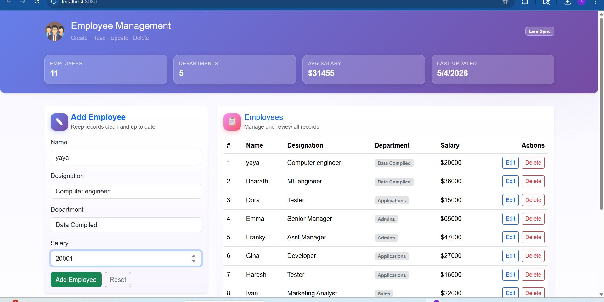
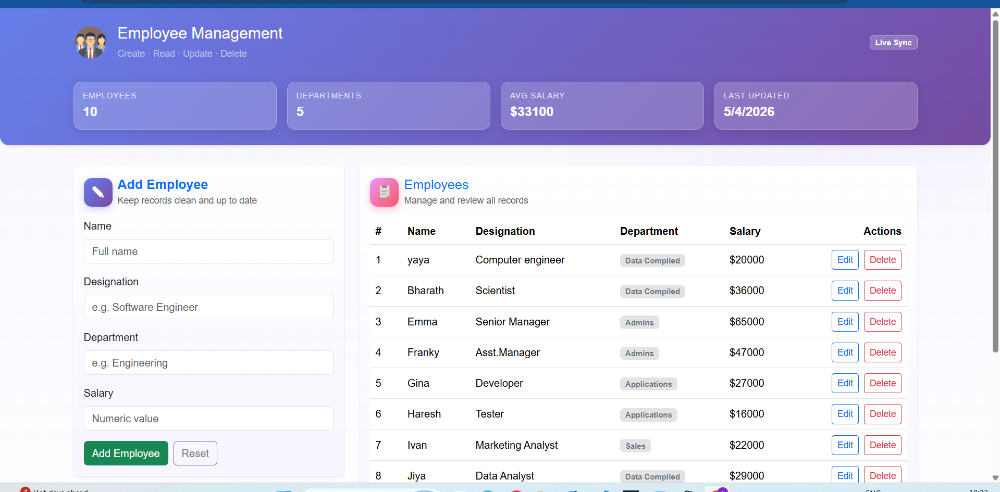
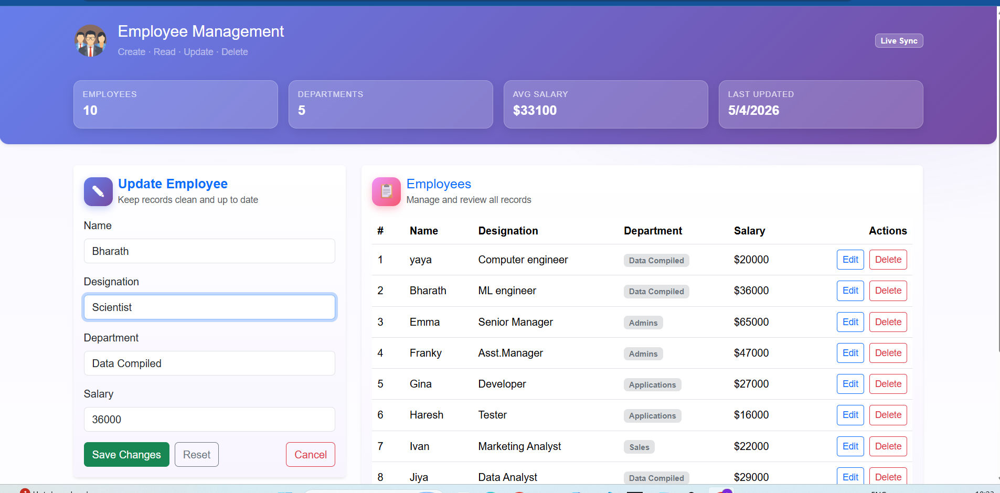
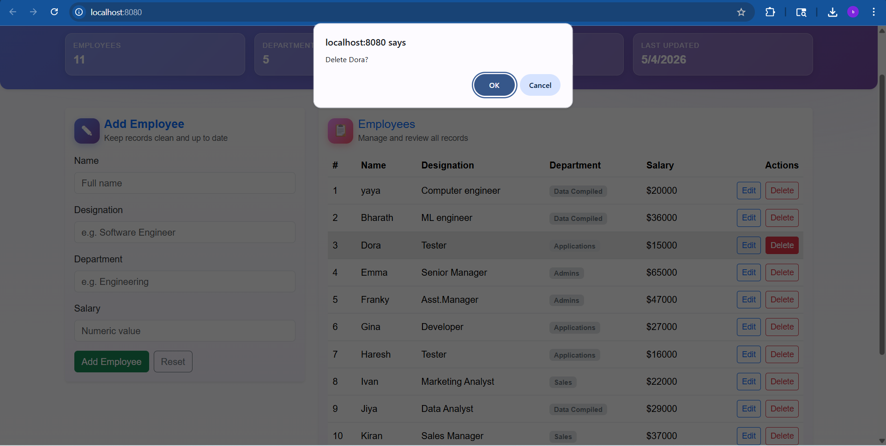
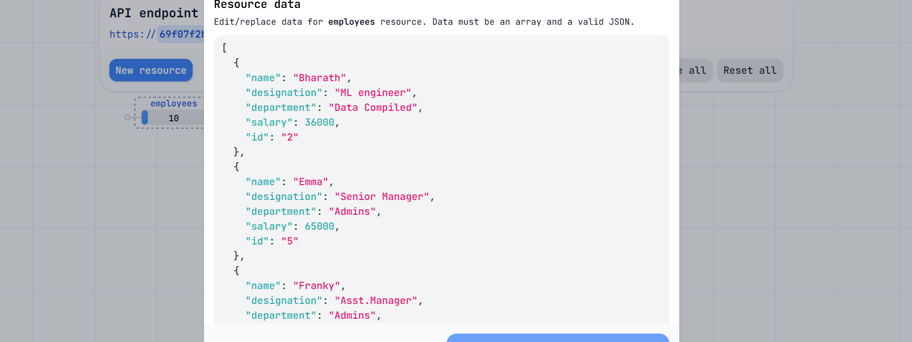

# 📘 Employee Management System

## 📌 Overview

The **Employee Management System** is a single-page web application developed using Vue.js. It enables users to manage employee records through a clean and responsive interface. The application supports full CRUD (Create, Read, Update, Delete) operations by integrating with an external API service such as MockAPI (or optionally MongoDB Atlas).

This project demonstrates practical implementation of frontend development, API integration, and component-based architecture.

---

## 🎯 Features

* Add new employee records
* View all employees in a structured table
* Update existing employee details
* Delete employee records
* Responsive user interface using Bootstrap
* Real-time data interaction via API

---

## 🛠️ Tech Stack

* **Frontend:** Vue.js 3
* **HTTP Client:** Axios
* **Styling:** Bootstrap 5
* **Backend (Mock):** MockAPI
* **Build Tool:** Vue CLI

---

## 🚀 Getting Started

### Prerequisites

* Node.js and npm installed
* Vue CLI installed globally

### Installation

1. Navigate to the project directory:
   ```bash
   cd employee_app
   ```
2. Install project dependencies:
   ```bash
   npm install
   ```
3. Dependencies already included:
   - Bootstrap 5 for styling
   - Axios for API communication

---

## 🌐 API Configuration

The application uses Axios to communicate with the MockAPI REST API for employee data management.

### MockAPI Setup

1. Create a new project on [MockAPI](https://mockapi.io)
2. Define a resource named **employees**
3. Add the following fields to your resource:
   * `name` (String)
   * `designation` (String)
   * `department` (String)
   * `salary` (Number)
4. Replace the base URL in `src/services/employeeService.js` with your MockAPI endpoint

### API Service

The app uses a centralized API service (`src/services/employeeService.js`) that handles:
* **GET** `/employees` - Fetch all employees

* **POST** `/employees` - Create a new employee
* **PUT** `/employees/:id` - Update an employee
* **DELETE** `/employees/:id` - Delete an employee

---

## 📁 Project Structure

```
employee_app/
├── public/
│   └── index.html
├── src/
│   ├── components/
│   │   ├── EmployeeForm.vue    # Form for adding/updating employees
│   │   └── EmployeeList.vue    # Table displaying all employees
│   ├── services/
│   │   └── employeeService.js  # API communication layer
│   ├── App.vue                 # Main application component with state management
│   ├── main.js                 # Application entry point
│   ├── assets/                 # Static assets
│   └── ...
├── package.json
├── vue.config.js
└── jsconfig.json
```

### Component Details

* **App.vue**: Main container handling employee state, CRUD operations, error management, and dashboard stats
* **EmployeeForm.vue**: Reusable form component for create and edit operations with purple gradient styling
* **EmployeeList.vue**: Responsive table component displaying employees with department badges and action buttons
* **employeeService.js**: Axios instance configured to communicate with MockAPI endpoint

---

## 🔄 Application Workflow

### Create

Users can enter employee details through a form and submit them to be stored in the database.




### Read

Employee data is fetched from the API and displayed in a tabular format.



### Update

Existing employee details can be modified and saved, updating the data in real time.




### Delete

Users can remove employee records, which deletes them from both the API and UI.





---

## 🎨 User Interface

* Built with Bootstrap 5 for responsive, modern design
* **Color Scheme**: Purple-to-pink gradient theme with vibrant accents
* **Header**: Hero section with gradient background, live sync badge, and KPI tiles (employee count, departments, avg salary, last updated)
* **Dashboard Stats**: Real-time statistics about employees and departments
* **Components**: 
  * Form section with 📝 (pencil) icon for data entry
  * Responsive table with 📋 (clipboard) icon for employee listing
  * Department badges with color-coding for different departments
* **Styling**: Gradients, shadows, and smooth animations for enhanced UX
* **Table Actions**: Edit and Delete buttons with confirm dialogs
* **Error Handling**: User-friendly error messages and loading states

---

## 🧹 Code Quality

* Follows component-based architecture
* Separates API logic from UI components
* Uses meaningful naming conventions
* Maintains clean and readable structure
* Ensures reusability and scalability

---

## ▶️ Running the Application

1. Install dependencies:
   ```bash
   npm install
   ```

2. Start the development server:
   ```bash
   npm run serve
   ```

3. The application will open at `http://localhost:8080` (or the next available port)

4. Test all CRUD operations:
   - **Create**: Fill the form and click "Add Employee"
   - **Read**: View the employee table
   - **Update**: Click "Edit" on any employee row to modify
   - **Delete**: Click "Delete" to remove an employee

5. Build for production:
   ```bash
   npm run build
   ```

---

## 📦 Deployment
This app will be hosted live on github pages.
The link for the website: https://bharathy2302.github.io/web_programming_assignment2/

### Pre-Deployment Checklist

- ✅ All CRUD operations tested locally
- ✅ MockAPI endpoint configured correctly
- ✅ No console errors in development
- ✅ Responsive design verified on mobile devices

---
## 🔧 Troubleshooting

### Port Already in Use
If port 8080 is busy, Vue CLI will automatically use the next available port.

### API Connection Issues
- Verify the MockAPI endpoint URL in `src/services/employeeService.js`
- Check that the resource name matches "employees" in your MockAPI project
- Ensure your browser allows CORS requests to the MockAPI server

### Build Errors
- Delete `node_modules` and run `npm install` again
- Clear the Vue CLI cache with `npm run serve -- --reset-cache`

---

## ✅ Conclusion

This Employee Management System showcases modern Vue.js development practices with:
- **Component-Based Architecture**: Reusable, maintainable components
- **API Integration**: Seamless MockAPI communication via Axios
- **Responsive Design**: Bootstrap 5 with custom gradients and styling
- **Real-Time Updates**: Live employee data management
- **Professional UI**: Modern gradient theme with emoji icons and smooth interactions

The project serves as a solid foundation for building scalable, real-world web applications with Vue.js.
